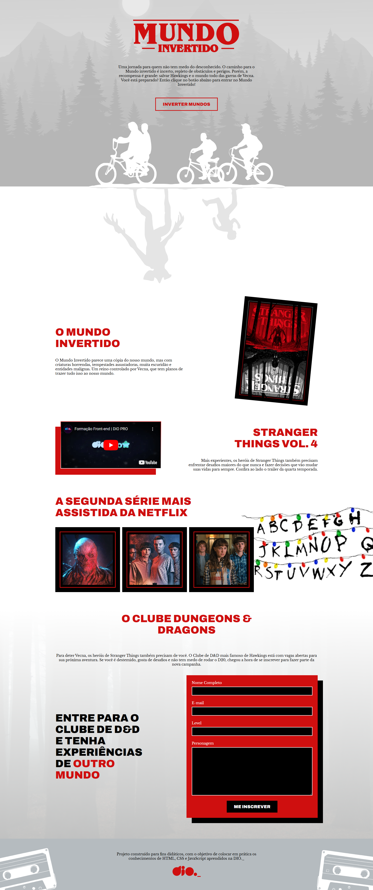
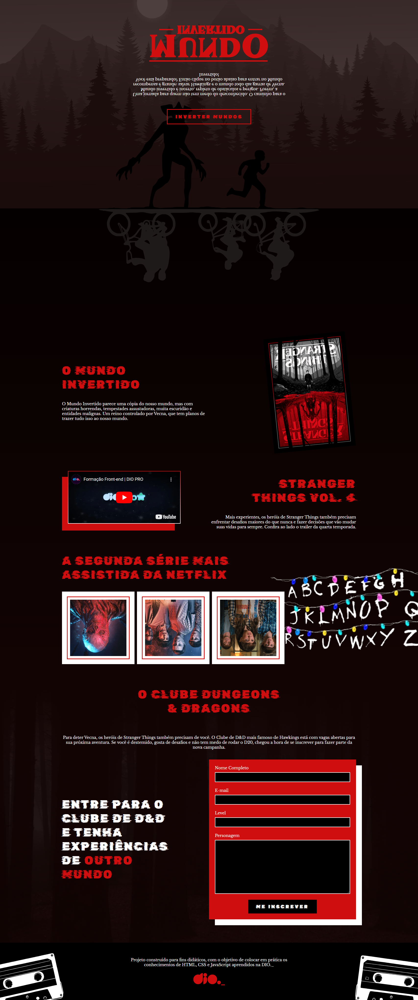

# page-mundo-invertido

## Projeto criado para aprendizagem de HTML5 e CSS3

<a href='https://mmouralmelo.github.io/page-mundo-invertido/'>Clique aqui para visualizar o site</a>  

Visualização da página no tema claro
  

Ao clicar no botão "Inverter Mundos" será alterado para o tema escuro
  

 
